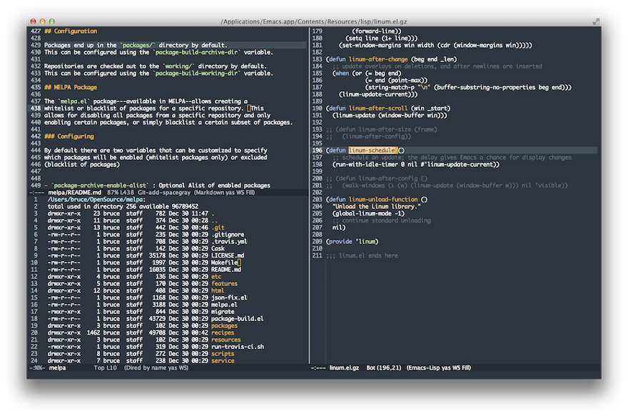

emacs-spacegray-theme
=====================

Emacs port of the excellent
[Spacegray theme for Sublime Text](https://github.com/kkga/spacegray).

## Installation

If you're all set up to use [MELPA](http://melpa.milkbox.net/#/getting-started), simply

    M-x package-install RET spacegray-theme RET

Otherwise, ensure sure a directory containing these files is on your `load-path`.

Use `M-x customize-themes` to activate it, or put the following in your Emacs configuration file:

    (load-theme 'spacegray t)

## Screenshot



## Suggested Configuration

Always highlight the current line:

```lisp
(global-hl-line-mode 1)
```
Show line numbers, dynamically with spaces on either side:

```lisp
(global-linum-mode 1)

(defadvice linum-update-window (around linum-dynamic activate)
  (let* ((w (length (number-to-string
                     (count-lines (point-min) (point-max)))))
         (linum-format (concat " %" (number-to-string w) "d ")))
    ad-do-it))
```

You may want to turn off linum for certain modes (this uses
[linum-off](http://www.emacswiki.org/emacs/linum-off.el)):

```lisp
(require 'linum-off)
```

Highlight the current line number (requires [hlinum](https://code.google.com/p/hlinum-mode/)):

```lisp
(require 'hlinum)
(hlinum-activate)
```

Collapse fringes:

```lisp
(fringe-mode -1)
```

## Credits

* Gadzhi Kharkharov for the original
  [Spacegray](http://kkga.github.io/spacegray/) color theme on Sublime
  Text.
* Ozan Sener for
  [afternoon-theme](https://github.com/osener/emacs-afternoon-theme/),
  used as boilerplate for this package.
* Steve Purcell for
  [color-theme-sanityinc-tomorrow](https://github.com/purcell/color-theme-sanityinc-tomorrow/),
  which afternoon-theme was based on.
